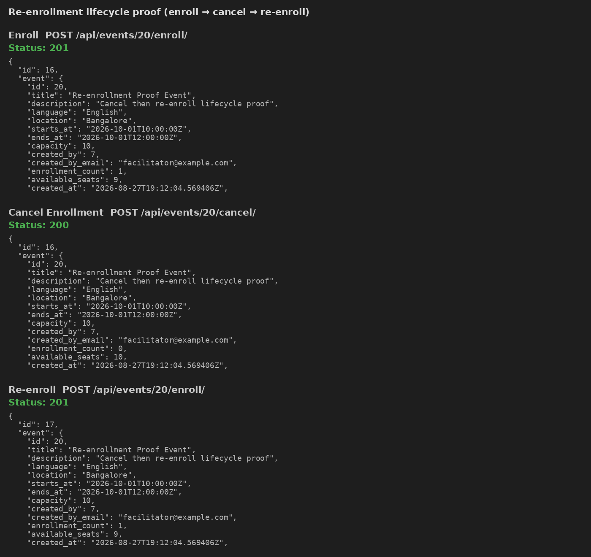
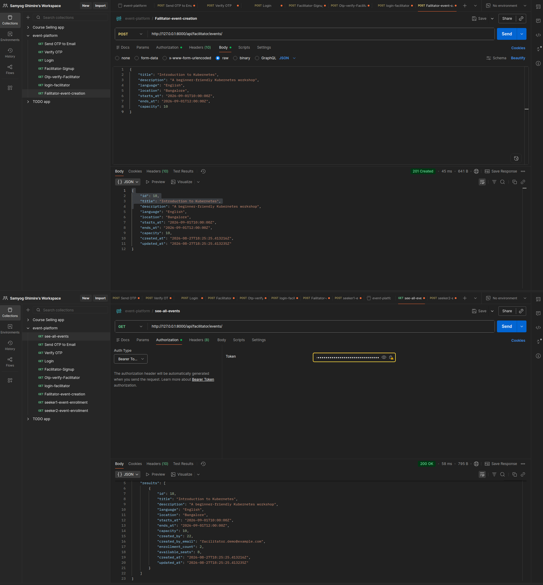
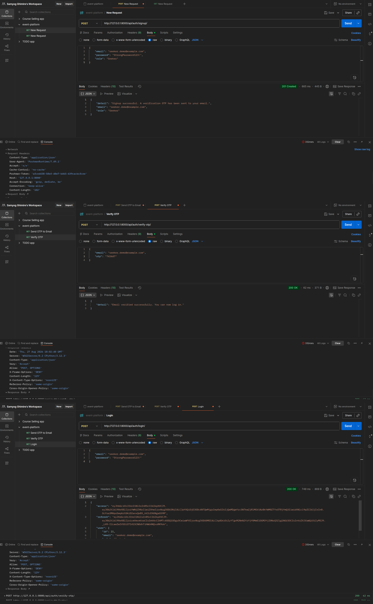

# DECISIONS.md

Architecture Decision Records for the Events Platform backend.

---

## ADR-1 — Pessimistic locking (`select_for_update`) for enrollment capacity

### Context

Challenge A requires that when `capacity=10` and 9 seats are taken, five simultaneous
enrollments must yield exactly one success and four `capacity_full` failures —
never 11+ active enrollments.

### Options considered

| Approach | Pros | Cons |
|---|---|---|
| Application-level check only | Simple | Race-prone (proven in Chaos A: 5/5 overbook) |
| Optimistic locking (`version` column + retry) | No long-held locks | Complex retry UX; still needs unique safety net |
| `SELECT … FOR UPDATE` on `Event` | Simple, serializes per-event writers | Brief lock contention under hot events |
| Serializable isolation | DB enforces conflicts | More retries / serialization failures app-side |

### Decision

Use **`transaction.atomic()` + `Event.objects.select_for_update()`** in
`events/services.py::enroll_seeker`, then recount `ENROLLED` rows and insert.

### Consequences

- Active enrollment count never exceeds `capacity` (verified by
  `events/tests/test_concurrency.py`).
- Throughput is serialized per event row — acceptable for workshop-scale capacity.
- Chaos A (`chaos/chaos_a_concurrency.py`) documents the failure mode without the lock.



---

## ADR-2 — Partial unique constraint for re-enrollment lifecycle

### Context

Challenge B: a seeker must enroll, cancel, and re-enroll while retaining cancelled
rows as audit history. A permanent `unique_together = (event, seeker)` breaks that
flow (Chaos B `IntegrityError`).

### Options considered

| Approach | Pros | Cons |
|---|---|---|
| `unique_together(event, seeker)` | Simple | Blocks re-enrollment forever |
| Soft-delete / revive same row | One row per pair | Weak audit of cancellation history |
| Partial `UniqueConstraint(condition=ENROLLED)` | Allows many CANCELLED + one ENROLLED | Postgres-specific partial index semantics |
| Application-only uniqueness | Flexible | Race can create two ENROLLED rows |

### Decision

```python
models.UniqueConstraint(
    fields=["event", "seeker"],
    condition=Q(status="ENROLLED"),
    name="unique_active_enrollment_per_seeker_event",
)
```

Cancel → set `status=CANCELLED` (row kept). Re-enroll → **insert a new** `ENROLLED`
row. Prior cancellations remain queryable.

### Consequences

- At most one active enrollment per seeker/event, enforced by PostgreSQL.
- Multiple `CANCELLED` rows are allowed (audit trail).
- Manual DDL must use `CREATE UNIQUE INDEX … WHERE`, not
  `ALTER TABLE … UNIQUE … WHERE` (see DEBUGGING.md Issue 2).



---

## ADR-3 — OTP single-active invalidation policy

### Context

Challenge C: if OTP₁ is issued and OTP₂ is requested 30s later, submitting OTP₁
must fail with `invalid_or_expired_otp`. Additional rules: 5-minute TTL, 60s
resend cooldown, max 3 failed attempts per OTP.

### Options considered

| Approach | Pros | Cons |
|---|---|---|
| Keep all OTPs valid until TTL | Simple | OTP₁ remains usable after resend — insecure |
| Overwrite single OTP row | One row | Loses issuance history |
| Revoke prior actives on each issue | Clear single-active invariant | Extra update on resend |
| Store plaintext OTP | Easy debugging | Unacceptable secret exposure |

### Decision

On every `create_and_send_otp`:

1. Enforce 60s cooldown against the latest row’s `created_at`.
2. `UPDATE … SET is_revoked=True` for all unused, unrevoked OTPs for that user
   (under `select_for_update`).
3. Insert a new row with **SHA-256(`code`)** only — never persist or log plaintext.
4. Email the plaintext via Django console/file backend only.
5. On verify: reject revoked/expired/locked OTPs; commit `attempt_count`
   **before** raising `APIError` so counters survive the failure path.

### Consequences

- Submitting a superseded OTP always yields `invalid_or_expired_otp`.
- Logs contain `otp_id` / `user_id` / attempt counts — never the code.
- Covered by `accounts/tests/test_otp.py` (TTL, cooldown, attempts, invalidation,
  signup→verify→login).



---

## ADR-4 — Default User + Profile (roles), email as public identifier

### Context

Assignment forbids swapping/extending `AUTH_USER_MODEL`. Roles are Seeker /
Facilitator. Public API must not accept `username`.

### Decision

- Keep Django’s default `User`.
- `Profile` 1-to-1 holds `role` + `is_email_verified`.
- Signup accepts `{email, password, role}`; username is set internally to the
  normalized email.
- Login gated on `profile.is_email_verified`.

### Consequences

- Compatible with SimpleJWT out of the box.
- Admin / createsuperuser still work with username under the hood.
- API rejects bodies that include `username` with `username_not_allowed`.

---

## ADR-5 — Permission denial codes in standardized errors

### Context

Custom `BasePermission` subclasses define machine-readable `code` values
(`facilitator_required`, `seeker_required`, `email_not_verified`). DRF raises
`PermissionDenied` with that code on `ErrorDetail`, but our exception handler
preferred `exc.default_code` (`permission_denied`), wiping the specific code.

### Decision

In `config.exceptions.standard_exception_handler`, prefer
`exc.detail.code` over `exc.default_code` for non-`APIError` exceptions.

### Consequences

- Authz failures return stable, assignment-aligned `{detail, code}` pairs.
- Verified by `events/tests/test_authz.py`.
