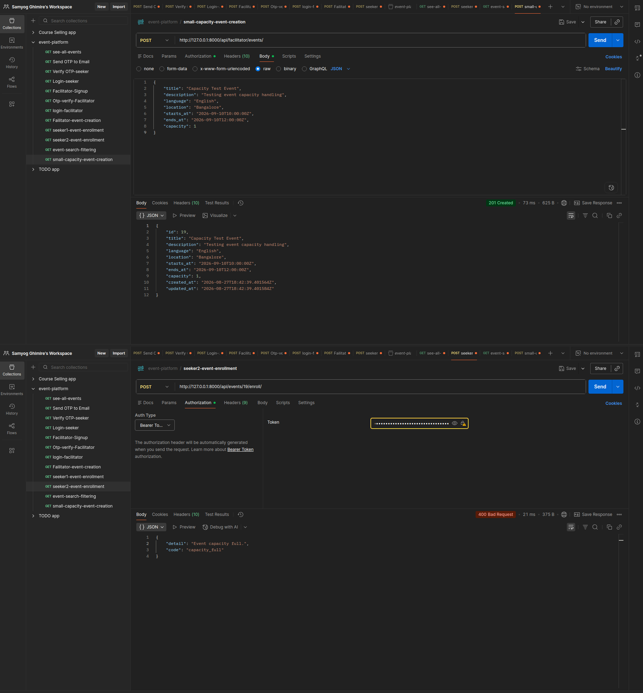
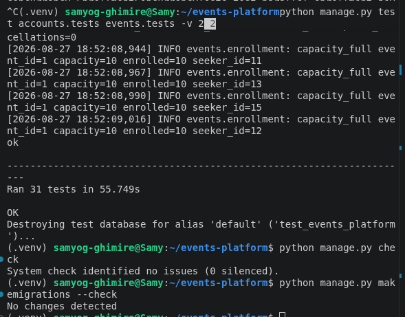

# PROMPT_LOG.md

Log of AI-assisted engineering for the Events Platform DRF backend.

---

## Session overview

| Field | Value |
|---|---|
| Role | Principal Backend Engineer & System Architect (AI pair) |
| Stack delivered | Django 5.0 / DRF / SimpleJWT / PostgreSQL 16 |
| Workspace | `/home/samyog-ghimire/events-platform` |
| Date | 2026-08-27 |

---

## Interaction timeline

### 1. Scaffold & constraints intake

**Prompt (summary):** Build a production-ready Events Platform with OTP auth,
concurrency-safe enrollment, partial unique re-enrollment, standardized errors,
docs, Postman collection, and **live chaos experiments** to feed `DEBUGGING.md`.

**Actions:**
- Created project `config`, apps `accounts` + `events`
- Docker Compose Postgres on port `5433`
- Standardized exception handler → `{"detail", "code"}`
- DRF page pagination (`count`, `next`, `previous`, `results`)

### 2. Domain implementation

**Code produced:**
- `accounts`: `Profile`, `EmailOTP`, OTP service (SHA-256), signup/verify/resend/login
- `events`: `Event`, `Enrollment`, search filters, facilitator CRUD, enroll/cancel
- `events/services.py`: `select_for_update` enrollment
- Partial `UniqueConstraint(condition=Q(status='ENROLLED'))`
- Management command `seed_demo`
- Tests: `test_otp.py`, `test_concurrency.py`, `test_lifecycle.py`
- Chaos scripts: `chaos_a_concurrency.py`, `chaos_b_unique_together.py`

### 3. Live break-and-fix

**Prompt mandate:** Do not invent `DEBUGGING.md` — run Chaos A/B and paste real traces.

**Actions:**
- Chaos A removed `select_for_update` → **5 enrollments on capacity=1**
- Chaos B installed naive `UNIQUE(event, seeker)` → **IntegrityError** on re-enroll
- Invalid partial-unique DDL captured → `syntax error at or near "WHERE"`
- Artifacts captured under `chaos/artifacts/` during live runs, then **sanitized
  and committed** under `docs/proof/` for ZIP submission (see Correction below
  on gitignore)

### 4. Hardening after real failures

**Changes after observing failures:**
- Locked enrollment path kept as production default
- Chaos B restore path corrected to `CREATE UNIQUE INDEX … WHERE`
- OTP `attempt_count` increments committed **before** raising `APIError` (see below)

### 5. Documentation & proof assets

- `README.md`, `DECISIONS.md`, `DEBUGGING.md`, `PROMPT_LOG.md`
- `docs/API_PROOF.md` (screenshot / asciinema / vhs instructions)
- `events_platform.postman_collection.json` with JWT capture scripts
- Committed proof screenshots in `docs/proof/01-auth-flow.png` … `06-test-suite.png`







---

## What AI Got Wrong / What I Corrected

### Correction 1 — Naive `unique_together` would have broken re-enrollment

**What the AI initially leaned toward:** A standard
`unique_together = ("event", "seeker")` (or unconditional `UniqueConstraint`) is the
“obvious” way to prevent double enrollment.

**Why it was wrong:** After cancel, the cancelled row still occupies `(event, seeker)`.
Re-enrollment inserting a new `ENROLLED` row raises:

```text
IntegrityError: duplicate key value violates unique constraint
"chaos_naive_unique_event_seeker"
DETAIL: Key (event_id, seeker_id)=(6, 14) already exists.
```

**What I corrected:** Partial unique constraint conditioned on `status='ENROLLED'`,
plus an explicit lifecycle that **keeps** `CANCELLED` rows as audit logs and inserts
a fresh `ENROLLED` row on re-join. Proven by Chaos B + `test_lifecycle.py`.

### Correction 2 — Raising inside `atomic()` wiped OTP attempt counters

**What the AI first wrote:** Inside `transaction.atomic()`, on bad OTP:

```python
otp.attempt_count += 1
otp.save(update_fields=["attempt_count"])
raise APIError(..., code="invalid_or_expired_otp")
```

**Why it was wrong:** `APIError` aborted the atomic block → PostgreSQL rolled back
the `attempt_count` update. Test logs showed `attempts=1` on every failure; lockout
never triggered (`test_max_attempts_lockout` failed).

**What I corrected:** Perform the increment/save inside `atomic()`, exit the block
successfully, **then** raise `APIError`. Attempt counters now persist; max-3 lockout
passes.

### Correction 3 — Plaintext OTP logging temptation

**What a careless AI path would do:** `logger.info("OTP for %s is %s", email, code)`.

**Why it was wrong:** Assignment + production security forbid plaintext OTP in
application logs and API responses.

**What I corrected:** Persist SHA-256 only; log `user_id` / `otp_id` / `expires_at` /
`revoked_prior`; deliver plaintext solely via email backend (console/file). Signup
response contains no OTP field — asserted in `test_signup_verify_login_flow`.

### Correction 4 — Partial unique via `ALTER TABLE … WHERE`

**What went wrong during Chaos B restore:** Assumed PostgreSQL accepts

```sql
ALTER TABLE ... ADD CONSTRAINT ... UNIQUE (event_id, seeker_id) WHERE (...);
```

**Reality:** `syntax error at or near "WHERE"`. Django emits a **unique index**.
Restore scripts now use `CREATE UNIQUE INDEX … WHERE`.

### Correction 5 — Audit: permission codes swallowed as `permission_denied`

**What the audit found:** `IsFacilitator` / `IsSeeker` / `IsEmailVerified` set
`code = "facilitator_required"` etc., but `standard_exception_handler` preferred
`PermissionDenied.default_code` (`permission_denied`).

**What was corrected:** Prefer `ErrorDetail.code` from the exception detail.
Regression tests in `events/tests/test_authz.py`.

### Correction 6 — Audit: naive `starts_after` / `starts_before`

**What the audit found:** `parse_datetime()` without `make_aware` under
`USE_TZ=True` produced `RuntimeWarning` and unreliable filters.

**What was corrected:** `_parse_aware_datetime()` treats naive ISO strings as
project-timezone-aware. Covered by `SearchTimezoneFilterTests`.

### Correction 7 — Chaos evidence missing from ZIP (gitignore)

**What was wrong:** `.gitignore` excluded `chaos/artifacts/` and `*.log`, so
`DEBUGGING.md` pointed at logs that never shipped in the submission archive.

**What was corrected:** Sanitized evidence copied to `docs/proof/*.log`,
`.gitignore` allows `!docs/proof/*.log`, and `DEBUGGING.md` / `chaos/README.md`
reference the committed paths. Local chaos re-runs still write to gitignored
`chaos/artifacts/`.

---

## Final verification commands run

```bash
python manage.py test accounts.tests events.tests -v 2
# OTP + lifecycle + concurrency + authz/timezone … OK

python chaos/chaos_a_concurrency.py   # overbooking reproduced
python chaos/chaos_b_unique_together.py  # IntegrityError + fix verified
ls docs/proof/*.log                   # committed evidence present
```
