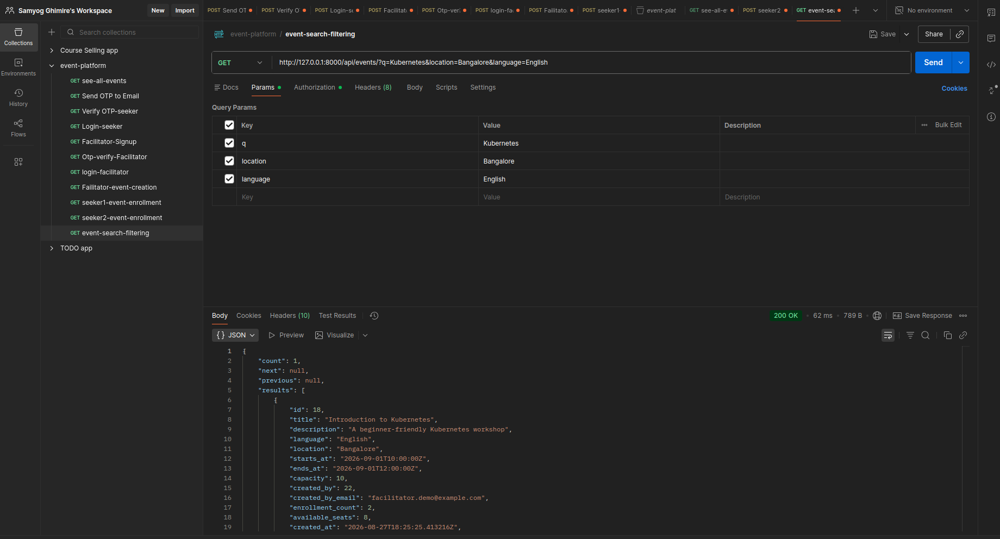

# Events Platform — Django REST Backend

Production-oriented DRF API for facilitators (CRUD events) and seekers (search,
enroll, cancel, re-enroll), with hashed email OTP verification, SimpleJWT auth,
PostgreSQL partial unique constraints, and pessimistic enrollment locking.

---

## Quick start (local)

### Prerequisites

- Python 3.12+
- Docker (for PostgreSQL) **or** a local Postgres 14+ instance
- `psql` optional

### 1. Database

```bash
docker run -d --name events-pg \
  -e POSTGRES_USER=events \
  -e POSTGRES_PASSWORD=events \
  -e POSTGRES_DB=events_platform \
  -p 5433:5432 postgres:16-alpine
```

Or: `docker compose up -d db`

### 2. App

```bash
cd events-platform
python3 -m venv .venv
source .venv/bin/activate
pip install -r requirements.txt
cp .env.example .env   # defaults target localhost:5433
python manage.py migrate
python manage.py seed_demo
python manage.py runserver
```

### 3. Demo credentials (from `seed_demo`)

| Role | Email | Password |
|---|---|---|
| Facilitator | `facilitator@example.com` | `Passw0rd!` |
| Seeker | `seeker1@example.com` … `seeker5@example.com` | `Passw0rd!` |

Seeded users are **already email-verified**.

### Optional: full Docker stack

```bash
docker compose up --build
# API → http://127.0.0.1:8000
```

---

## Architecture summary

```text
┌─────────────┐     JWT      ┌──────────────────┐
│   Client    │ ───────────► │  DRF API (config) │
└─────────────┘              └────────┬─────────┘
                                      │
                 ┌────────────────────┼────────────────────┐
                 ▼                    ▼                    ▼
           accounts              events              PostgreSQL
        Profile + OTP         Event + Enrollment    indexes +
        SimpleJWT login       select_for_update     partial unique
```

- **Default Django `User`** only — roles via 1-to-1 `Profile` (`Seeker` | `Facilitator`).
- **OTP**: SHA-256 hashed, 5 min TTL, 60s resend cooldown, 3-attempt lockout,
  prior OTPs revoked on resend.
- **Enrollment**: `select_for_update` on `Event`; partial unique on active rows.
- **Errors**: `{"detail": "...", "code": "..."}` via `config.exceptions`.
- **Pagination**: DRF `PageNumberPagination` → `count`, `next`, `previous`, `results`.

---

## API route map

| Method | Path | Who | Notes |
|---|---|---|---|
| POST | `/api/auth/signup/` | Public | `{email, password, role}` — no `username` |
| POST | `/api/auth/verify-otp/` | Public | `{email, otp}` |
| POST | `/api/auth/resend-otp/` | Public | cooldown enforced |
| POST | `/api/auth/login/` | Public | verified email + password → JWT |
| POST | `/api/auth/token/refresh/` | Public | SimpleJWT refresh |
| GET | `/api/auth/me/` | Auth | profile |
| GET/POST | `/api/facilitator/events/` | Facilitator | list w/ `enrollment_count`, `available_seats` |
| GET/PATCH/DELETE | `/api/facilitator/events/{id}/` | Owner | CRUD own events |
| GET | `/api/events/` | Auth | search: `q`, `location`, `language`, `starts_after`, `starts_before` |
| GET | `/api/events/{id}/` | Auth | detail + seat counts |
| POST | `/api/events/{id}/enroll/` | Seeker | concurrency-safe |
| POST | `/api/events/{id}/cancel/` | Seeker | status → `CANCELLED` |
| GET | `/api/enrollments/me/` | Seeker | `?scope=upcoming\|past\|all` |
| GET | `/api/docs/` | — | Swagger UI |
| GET | `/api/schema/` | — | OpenAPI schema |

Import **`events_platform.postman_collection.json`** for scripted JWT flows.

---

## Tests

The suite currently contains **31 automated tests** covering:

- OTP security and lifecycle
- authentication
- authorization
- timezone-aware search
- concurrency
- enrollment lifecycle
- database constraints
- standardized API errors (400 / 401 / 403 / 404 contract)

```bash
source .venv/bin/activate
python manage.py test accounts.tests events.tests -v 2
```

| Module | Covers |
|---|---|
| `accounts/tests/test_otp.py` | Hashing, TTL, cooldown, attempts, invalidation, auth flow |
| `events/tests/test_concurrency.py` | Parallel enroll never exceeds capacity |
| `events/tests/test_lifecycle.py` | Cancel → re-enroll, partial unique, API errors |
| `events/tests/test_authz.py` | Role denial codes, unverified access, timezone-aware search |
| `events/tests/test_error_contract.py` | 400/401/403/404 always return `{detail, code}` only |

Standardized errors use `{"detail": "...", "code": "..."}` on validation,
OTP, capacity, and permission failures (e.g. `facilitator_required`,
`seeker_required`, `email_not_verified`, `capacity_full`).

---

## Live chaos experiments (break → observe → fix)

See **`DEBUGGING.md`** and committed logs under **`docs/proof/`**. To reproduce:

```bash
# Experiment A — remove locking mentally (script already uses unlocked path)
python chaos/chaos_a_concurrency.py
# Expect: FINAL active ENROLLED count = 5 (capacity was 1)

# Experiment B — swap in naive UNIQUE(event, seeker)
python chaos/chaos_b_unique_together.py
# Expect: IntegrityError on re-enroll, then FIX VERIFIED under partial unique
```

Production code already contains the fixes; chaos scripts temporarily violate them
for demonstration. Fresh local runs write to gitignored `chaos/artifacts/`; the
submission includes sanitized copies in `docs/proof/`.

---

## Visual proof (screenshots / terminal recordings)

Step-by-step instructions: **[`docs/API_PROOF.md`](docs/API_PROOF.md)**.

Committed proof screenshots in **`docs/proof/`**:

| # | File | What it shows |
|---|---|---|
| 01 | [`01-auth-flow.png`](docs/proof/01-auth-flow.png) | Signup → verify OTP → login (JWT) |
| 02 | [`02-facilitator-event.png`](docs/proof/02-facilitator-event.png) | Facilitator create event + `available_seats` |
| 03 | [`03-event-search.png`](docs/proof/03-event-search.png) | Search by `q`, `location`, `language` |
| 04 | [`04-enrollment-capacity.png`](docs/proof/04-enrollment-capacity.png) | `capacity=1` + `capacity_full` error |
| 05 | [`05-reenrollment.png`](docs/proof/05-reenrollment.png) | Enroll → cancel → re-enroll (new id) |
| 06 | [`06-test-suite.png`](docs/proof/06-test-suite.png) | 31 automated tests pass |





Quick recording of the test suite:

```bash
# asciinema
asciinema rec docs/proof/tests.cast -c "python manage.py test accounts.tests events.tests -v 2"

# vhs (https://github.com/charmbracelet/vhs)
vhs docs/proof/tests.tape
```

---

## Known limitations

- Email is console/file only — no SMTP provider wired.
- No Redis/rate-limit gateway; OTP resend cooldown is DB-timestamp based.
- Facilitator cannot enroll as seeker under the same account (role is singular).
- `select_for_update` serializes hot events; very high write fan-in may need sharding
  or queueing later.
- SQLite is **not** supported for concurrency tests (requires PostgreSQL).

## Future improvements

- Outbox + real email provider; OTP delivery metrics
- Idempotency keys on enroll
- Soft-delete events + waitlist when capacity is full
- Read replicas for search; cursor pagination for large catalogs
- Audit event stream (Kafka / transactional outbox)

---

## Project docs

| File | Purpose |
|---|---|
| `DECISIONS.md` | ADRs: locking, partial unique, OTP policy |
| `DEBUGGING.md` | Real chaos failures + fixes |
| `PROMPT_LOG.md` | AI interaction log + corrections |
| `docs/API_PROOF.md` | Screenshot / GIF capture guide |
| `docs/proof/*.log` | Committed chaos evidence (ZIP-safe) |
| `docs/proof/*.png` | Committed proof screenshots (`01`–`06`) |
| `chaos/` | Break-and-fix scripts (local artifacts gitignored) |
